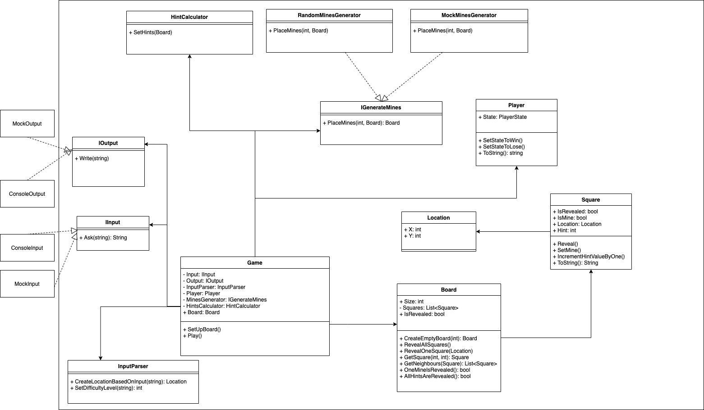

# Kata - Minesweeper
### Requirements

- A new game should start by specifying the difficulty of the game (all boards are squares)
    - e.g. if board has a difficulty of 4, the board has a width of 4 and a height of 4 and 4 mines
- Mines should be placed randomly
- The board should have two modes of display
    1. Only squares revealed by the player are displayed
    2. The entire revealed board is displayed
- A player should be able to select the next square to reveal
- If the chosen square is a mine, the game is over and the player loses
  - When the player loses, the entire revealed board is displayed
- If the chosen square is not a mine, that square is revealed with the number of mines that surround it, these number are the hints
- If all of the squares are revealed except mines, the player wins
### Game Flow Example
```
Please input Difficulty Value (an integer larger than 0):
2
Current Board:
. . 
. . 

Please input a coordinate to reveal one square on the board (e.g. 0,0):
0,0
Current Board:
2 . 
. . 

Please input a coordinate to reveal one square on the board (e.g. 0,0):
0,1
Game Over!
Result: Win
Current Board:
2 2 
* * 

```
### Class Diagram

